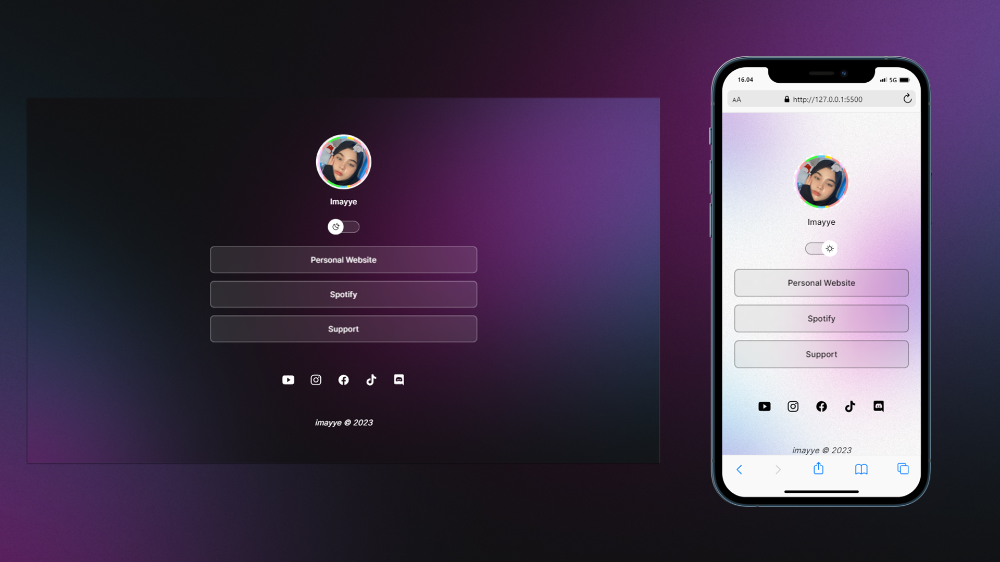

  <a href="#-techs">Tecnologia</a>&nbsp;&nbsp;&nbsp;|&nbsp;&nbsp;&nbsp;
  <a href="#-about">Sobre</a>&nbsp;&nbsp;&nbsp;|&nbsp;&nbsp;&nbsp;

  

 

## 🚀 Tecnologias

Usando as seguintes tecnologias

- JavaScript
- HTML
- CSS

## 💻 L RMN

Link Bio made with love
